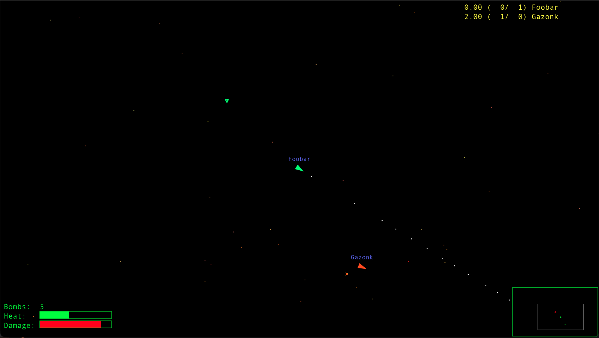

# SHH Space Game

Originally written in Java back in 1997/1998.
This is a reimplementation in Go, using the fantastic [github.com/gogpu](https://github.com/gogpu/) library to have platform-independent graphics without bundling any libraries.



This is a simple game for multiple players.
It reminds a bit about the good, old Asteroids arcade game, but there are no asteroids here.
Instead, there are other spaceships, controlled by other players.
This game is useless for you if you either a) don't have any friends, or b) don't have access to a computer network.
You may be able to find additional reasons for its uselessness.

In your window, you see only a part of the world.
Your ship stays centered in the view all the time.
In the lower right corner is a radar display showing the entire world.
A gray rectangle marks the area of the world you currently have in your window.
Enemy ships appear in the radar as green dots, while weapons left by dying enemies are shown as red dots.

You ship's status is shown in the lower left corner.
A ship damage meter shows how far you are from being blown completely away.
If this meter goes high, you should bail out of any battle you attend to, and spend some time on you own.
The ship will then slowly repair itself.
There is also a bomb count in the lower left corner, along with a phaser temperature meter.

Which brings us to the weapon systems.
There are two weapons available.
The phaser, of which you have an unlimited supply, fire in the direction of you ship's nose.
Multiple phaser hits are needed to take out an enemy.
Note that the phaser cannon tends to go warm after intensive shooting.
When it overheats, it will no longer work, and you'll have to wait for a while for the cannon to cool down.
Initially, your ship is also equipped with a few smart, targeting bombs.
These shoot-and-forget missiles will follow your closest enemy until they run out of fuel.
Two to three bombs are required to destroy a fully functional enemy ship.

If your ship is destroyed while you still have bombs left, the remaining bombs are left for others to pick up.

When you die, and you certainly will if you play this game for a while, you may resurrect by pressing the R button.

The upper right corner of the window shows the score table.
The score is based on a ratio from the number of kills over the number of times a player has been killed (the two numbers are given in parentheses).

## Steering Around

The following keys are used to operate the ship:
(If you forget, you may press and hold F1 while playing, to have a similar list popped up.)

| Keys | Function |
|------|----------|
| Up arrow | Move forward. Forward is the current direction of the ship's nose. |
| Down arrow | Reverse engine. |
| Left arrow | Turn left. |
| Right arrow | Turn right. |
| Ctrl or Space | Fire Phaser. |
| Shift or Alt | Fire targeting bomb. |
| R | Resurrect ship after dying. |
| F1 | Help on keys (only visible as long as you hold F1 down). |

## Starting to Play

One player must start a server for everybody to connect to.
The program may be started as a server, a client, or both.
Run `spacegame -h` to see how.

## Building

In order to build the source code, you will need to set an environment variable that is required when building with gogpu:

```shell
CGO_ENABLED=0 go build .
```

If this variable is not set, you will get a cryptic error message: `undefined: GOFFI_REQUIRES_CGO_ENABLED_0`

## TODO

* Make the controller a struct.
* Implement everything that is missing.
    * Chat messages.
* Add an API to let people make robot players.
